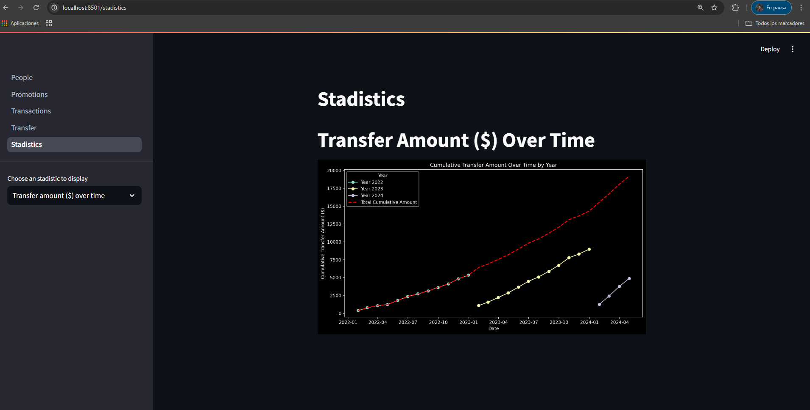
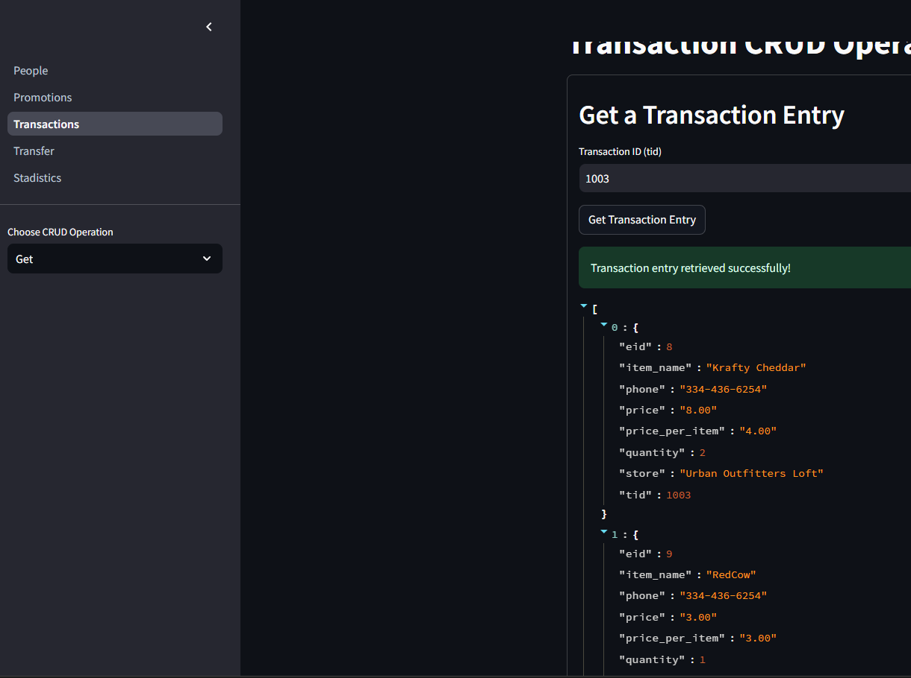

# Requirements

- Docker desktop

# Instructions to run the application:

In the src directory:

- docker-compose up --build

#### 

# To clean the aplication and its data run:

- docker-compose down -v

# To run the Dashboard use the following command

from the source directory
- streamlit run .\dashboard\streamlit_app.py
Then open the port localhost:8501

### (Wait for the backend to run and the db to be created)

#### If the ETL doesn't populate the db go to the app container and run the following command:
- python etl.py

### If want to visualize the entire tables open the localhost:8080 with the credential from the yml file

--- 

For this project I decided to use the Python programming language, since its commonly use in Data Engineering teams and it have the appropiate tools to complete these project.

To manipulate the data in the /data folder I decided to use the data integration process of Extract, Transform, Load (ETL), since I needed to cleand and organize data from multiple sources into a single and consistent data set storage, in this case a database using PostgreSQL. The entire project is running in Docker container so the environment that I'm using for develoment remain consistent in any machine that tries to run the code. For the backend I did a RESFUL api using Python, SQLAchemy, Flask and flask-sqlalchemy, where I did all the Create, Read, Update and Delele of each model. The models that I created to manage the data are the following

- people
- promotion
- transaction
- transfer

The schema.sql file have the structure of the database's tables, at the beginning I decided to have a device table to manege the devices but I decided to simplified and have the devices as booleans in the people table. As for the stadistics they are located in the traction and transfer routes. To display the data I use streamlit to create a dashboard where the user can manage all the crud operations and display the desired stadistics. For the transaction model I decided that each item will be an entry, I could have created a table only for the items but I decided to keep it simple.

